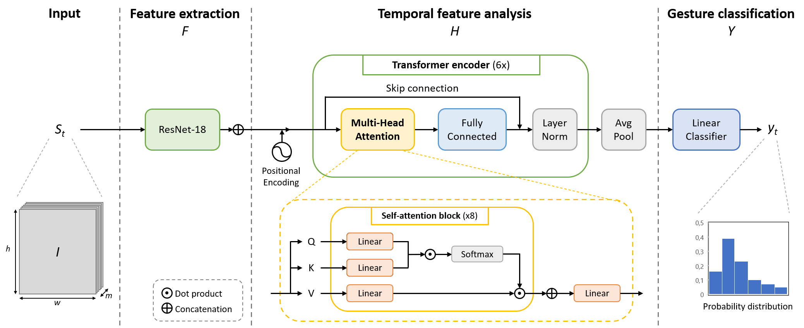
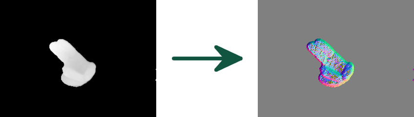

<h1 align="center">A Transformer-Based Network for Dynamic Hand Gesture Recognition</h1>

This is the official PyTorch implementation of the publication:

*A. D’Eusanio, A. Simoni, S. Pini, G. Borghi, R. Vezzani, R. Cucchiara*  
**A Transformer-Based Network for Dynamic Hand Gesture Recognition**  
*In International Conference on 3D Vision (3DV) 2020*

**[[Paper](https://iris.unimore.it/retrieve/handle/11380/1212263/282584/3DV_2020.pdf)]  [[Project Page](https://aimagelab.ing.unimore.it/imagelab/researchActivity.asp?idActivity=32)]**

Transformer-based neural networks represent a successful self-attention mechanism that achieves outstanding results in 
different topics, such as language understanding and sequence modeling. 
The application of such models to different types of data, like the visual one, is necessary to push the boundaries of 
common convolutinal and recurrent neural networks.  
Therefore, in this work we propose a transformer-based architecture for the dynamic hand gesture recognition task, 
focusing on the automotive environment.
Moreover, we propose the combined use of depth maps and surface normals as unique sources to successfully solve the 
task, even in low-light conditions.

<p align="center" width="100%">
  
</p>
<p align="center" width="100%">
  
</p>

The two datasets we used are NVGestures and Briareo. Both of them contain data from multiple sensors: RGB, IR, and 
depth, allowing the study of multimodal fusion techniques.

In this work, we focused on the sole use of the depth sensor, which provides light-invariant depth maps that can be 
further processed to obtain an estimation of the surface normals.  
Experimental results show that the use of such a simple processing step leads to a significant gain in accuracy.

<p align="center" width="100%">
  
</p>


## Getting Started
These instructions will give you a copy of the project up and running on your local machine for development and testing 
purposes. There isn't much to do, just install the prerequisites and download all the files.

### Prerequisites
Things you need to install to run the code:

```
Python >= 3.6.7
PyTorch >= 1.6
```

Install [CUDA](https://developer.nvidia.com/cuda-zone) and [PyTorch](https://pytorch.org/) following the main website directive.

Run the command:
```
pip install requirements.txt
```

## Download datasets
The employed datasets are publicy available: 
- **[NVGestures](https://research.nvidia.com/publication/online-detection-and-classification-dynamic-hand-gestures-recurrent-3d-convolutional "NVIDIA Dynamic Hand Gesture Dataset")**
- **[Briareo](https://aimagelab.ing.unimore.it/imagelab/page.asp?IdPage=31 "Briareo Dataset")**

Once downloaded, unzip anywhere in your drive.

## Pretrained model
Pytorch pretrained models are available at this [link](https://drive.google.com/drive/folders/1VXRmAVNP6dgomkovNu2uaFqwwbLs_GE-?usp=sharing "Pretrained weights").

## Setup configuration
For this project we used a json file, located in the hyperparameters folder, such as:  
`hyperparameters/Briareo/[train.json](https://aimagelab.ing.unimore.it/imagelab/page.asp?IdPage=31 "Briareo")`

In there, you can set several parameters, like:

- **Dataset**, Briareo or NVGestures.
- **phase**, select if training or testing.
- **Data-type**, select which source is used: depth, rgb, ir, surface normals or optical-flow.
- **Data-Nframe**, length of the input sequence, default: 40 frame.
- **Data-path**, path where you downloaded and unzipped the dataset.

For every other information check the file.

## Usage
```
python main.py --hypes hyperparameters/NVGestures/train.json
```
- `--hypes`, path to configuration file.

## Authors

* **Andrea D'Eusanio** - [Deusy94](https://github.com/Deusy94)
* **Alessandro Simoni** - [alexj94](https://github.com/alexj94)
* **Stefano Pini** - [stefanopini](https://github.com/stefanopini)
* **Guido Borghi** - [gdubrg](https://github.com/gdubrg)
* **Roberto Vezzani** - [robervez](https://github.com/robervez)
* **Rita Cucchiara** - [Rita Cucchiara](https://aimagelab.ing.unimore.it/imagelab/person.asp?idpersona=1)

## Ciatation
If you use this code, please cite our paper:
```
@inproceedings{d2020transformer,
  title={A Transformer-Based Network for Dynamic Hand Gesture Recognition},
  author={D'Eusanio, Andrea and Simoni, Alessandro and Pini, Stefano and Borghi, Guido and Vezzani, Roberto and Cucchiara, Rita},
  booktitle={International Conference on 3D Vision},
  year={2020}
}
```

## License

This project is licensed under the MIT License - see the [LICENSE](LICENSE) file for details
